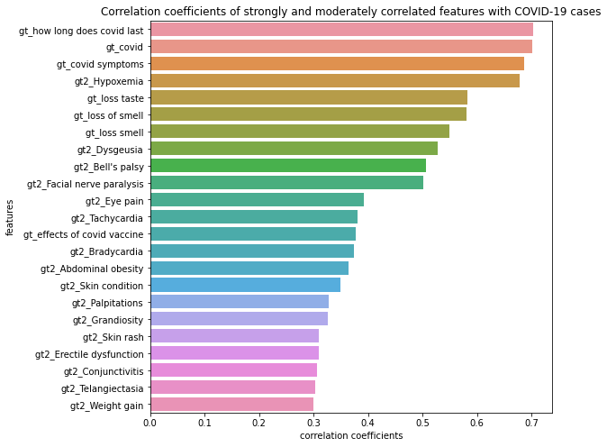
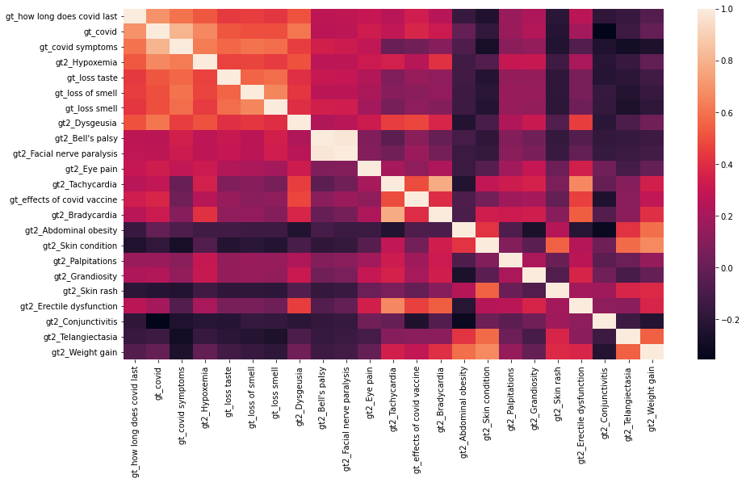
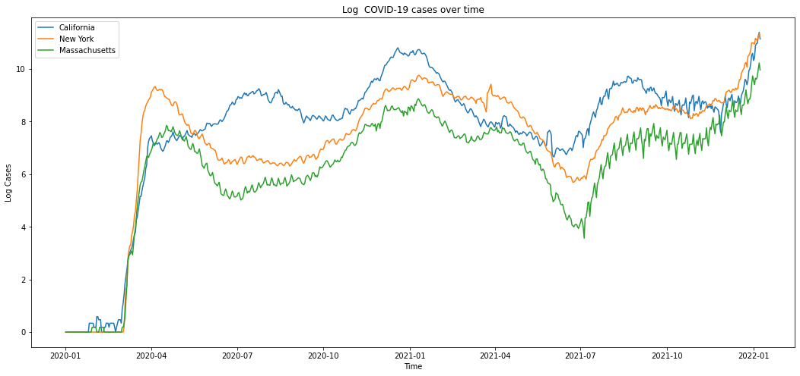
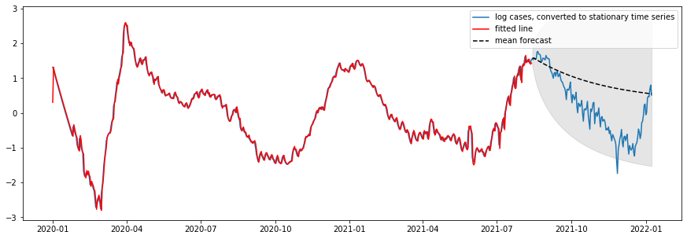
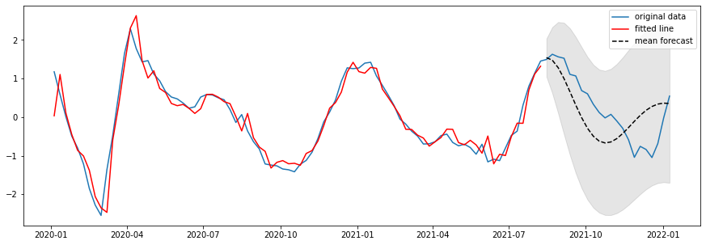

# Dynamics of Disease Transmission and Human Behavior Project

Team Members: Xinyun Stacy Li, Yujie Zhang, Di Zhen

[Exploratory Data Analysis](https://nbviewer.org/github/JoKerDii/Dynamics-of-Disease-Transmission-and-Human-Behavior/blob/main/exploratory_data_analysis.ipynb); [Time Series Analysis](https://nbviewer.org/github/JoKerDii/Dynamics-of-Disease-Transmission-and-Human-Behavior/blob/main/time_series_analysis.ipynb); [Improved Modeing](https://nbviewer.org/github/JoKerDii/Dynamics-of-Disease-Transmission-and-Human-Behavior/blob/main/improved_modeling.ipynb); [Project Notebook (old)](https://nbviewer.org/github/JoKerDii/Dynamics-of-Disease-Transmission-and-Human-Behavior/blob/main/project_notebook.ipynb).

## Project Overview

COVID-19 has caused a global impact since its outbreak in 2019. Various of efforts have been spent to predict and prevent the transmission of the virus. Some conducted time-series predicting of COVID-19 cases and deaths based on daily confirmed cases and deaths using deep neural network [1]. Others also incorporated features indicating human interactions, human mobility, and socioeconomic compositions of countries to make the prediction [2]. Here in this project, we explored and examined the effectiveness of predicting COVID-19 cases using Google trends. Given its potentially sensitive and fast reaction, Google trend pattern could provide important signals for the following changes in the number of COVID-19 cases and deaths.

There are two main goals: 

1) Assess the correlation between the terms searched by the public in Google and the number of COVID-19 cases; 
2) Build a recurrent neural network based model to predict the number of COVID-19 cases in the future based on Google Trends Data.

We propose applying neural network models including simple RNN, LSTM, and bidirectional LSTM to predict the confirmed COVID-19 cases for the following 7 days based on the Google trend data within 2 weeks. We focus on predictions for three states including California, New York, and Massachusetts, which are metropolitan representatives of the eastern and western U.S. The large populations in these states provide a clear picture of the transmission pattern of the virus over time. Moreover, we are also interested in the most predictive trends for these states and whether the model built from one state could generalize to the other two states.

## Data Description

We are working with a set of time-series data spanned nearly two years where each set corresponds to a state. This data is also used by another group for early COVID-19 warning approach [3]. The data contains dates, JHU confirmed  COVID-19 cases, deaths and hospitalization, clinicians interest in prescribing COVID-19 related medications from UpToDate, neighboring states' confirmed cases, and Google Search activities. JHU-cases are the reported COVID-19 cases on the John Hopkins platform, same with deaths and hospitalizations. The average missingness of the 50 states data is 14.52%, where a large proportion of Google trends features is only collected for the first year. 

## Exploratory Data Analysis (EDA)

We calculated <u>Pearson correlation coefficients</u> between each keyword's standardized relative search volume and the number of cases to have an idea of which features are mostly correlated with or even potentially predictive to the number of COVID-19 cases. We also calculated <u>lag and lead Pearson correlation coefficients</u> from 14 days before the first case to 14 days after the last case. **Figure 1** shows features that are strongly and moderately correlated with the number of cases. We then visualized the correlations between these google trend features by heatmap (**Figure 2**). We found Bell's paisy and Facial nerve paralysis appears to be highly correlated (corr>0.95). 

**Figure 3** displays a trend plot showing the number of COVID-19 cases varying with time in three states (California, New York, and Massachusetts). **Figure 4** displays a trend plot showing the number of COVID-19 cases, deaths, and hospitalizations varying with time in New York. Here we choose New York as an example. The trend of COVID-19 cases/deaths/hospitalizations of the other two states has similar shape.

**Figure 1**

**Figure 2**

**Figure 3**

**Figure 4**

## Data Cleaning and Preprocessing

We prepared feature table containing only Google Trends. We dropped features with more than roughly 20% (100) missing values. After that, we dropped 88 features, which wasn't a huge deduction compared to the total number of features we had. For the remaining features with missing values, we imputed the remaining missing value in all features by using KNN imputer. For the missing cases at the beginning of the pandemic, we believe the number of cases/deaths are 0 or close to 0. Therefore, we decided to replace nan with 0 in cases/deaths. We also flipped the sign of negative number of cases, because they are likely to be erroneous data. We removed 5 days in the end of the dataset because of NA cases.

We noticed that the confirmed case data was very ridged. Thus, we smoothed the outcome data using rolling mean of new cases with a window size of 5, in order to help the model learn and predict the true trend rather than being distracted by those jagged lines. We also take the log transformation of the cases to make the time series more stationary. For building ARIMA model specifically, we remove the cubic trend from the log cases in order to ensure the stationarity of the time series.

As a part of feature selection step, we dropped highly correlated features identified during EDA among all three datasets to reduce data dimensionality, so as to reduce computation cost. Since the gt features are in varies scales, we standardized the gt features by standard scaler.

In order to fit data into the RNN models, we first transformed two dimensional time-series data of shape [samples, features] into three dimensional structure of a shape [samples, time steps, features]. Specifically, we specified a time step of 14 days, then moved a sliding window of size [time steps, features] on the 2D dataset to capture the information for each time step and stacked them together to get a 3D data. Essentially, we add one dimension of time steps to the original data. We defined the features as our predictors X, and the final 7-day COVID-19 cases for each 14 day period as our target Y, meaning that we used the features from every 14 days to predict the cases of the last 7 days.

**Figure 5**: COVID-19 Cases after taking the rolling average with window size of 5, and log transformation.

## Model

### Baseline Model - ARIMA

We did one more step to make sure the stationarity specifically for building a ARIMA model, which is to remove the cubic trend. Then we look at the ACF and PACF of the residuals (log case - cubic regression line) to determine the order of AR(p) and MA(q). 

We use the ARIMA package to fit models to the data. Estimation goal: given an order $p, q$, find estimates of $\phi$ and $\theta$. The general form for an AR model of order $p$:
$$
X_t = \phi_1 X_{t-1} + \phi_2 X_{t-2} \dots + \phi_p X_{t - p} + \varepsilon_t
$$
And the form for an MA model of order $q$:
$$
X_t = \varepsilon_t + \theta_1 \varepsilon_{t-1} + \theta_2 \varepsilon_{t-2} \dots + \theta_q \varepsilon_{t-1}
$$
where $ɛ_t$ is mean zero white noise that's uncorrelated with any lagged or future values. 

With estimates of each $\theta$ and $\phi$ term, we predict one step ahead. 
$$
\hat{X}_{t + 1} = \hat{\phi}_1 X_{t} + \hat{\phi}_2 X_{t-1} \dots + \hat{\phi}_p X_{t - p + 1} + \hat{\theta}_1 \varepsilon_{t} + \hat{\theta}_2 \varepsilon_{t-1} \dots + \hat{\theta}_q \varepsilon_{t-q + 1}
$$
To form long-range forecasts, we can just plug in our estimate $\hat{X}_{t + 1}$ in place of $X_{t + 1}$ at every future value, and so on for other future estimates.

### Baseline Model - Simple RNN

As a baseline, we built a simple Recurrent Neural Networks (RNNs) model with a single 100 units layer to forecast the COVID-19 case number in the future, because RNNs are not only relatively easy to implement but also able to automatically learn the temporal dependencies.

### Advanced Models - LSTM & BiLSTM

LSTM is specifically designed for sequence data. It reads one time step of the sequence at a time and builds up an internal state representation that can be used as a learned context for making a prediction. Bidirectional LSTM can be beneficial to allow the LSTM model to learn the input sequence both forward and backwards and concatenate both interpretations. Therefore, we first designed a single layer LSTM model with 200 units, and then tried a bidirectional LSTM model with a single LSTM layer wrapped by a bidirectional wrapper layer.

### Model Design

We used ReLU activation function on each hidden layer, Adam optimizer with 0.001 learning rate, and Mean Square Error (MSE) loss. We used the trained models to make predictions and visualized the prediction performance overlapped with the true cases on the log scale.

## Results

ARIMA model.

| Models                             | MSE    |
| ---------------------------------- | ------ |
| 1-day ARIMA (cubic trend removed)  | 0.1949 |
| 1-week ARIMA (cubic trend removed) | 0.1621 |

RNN based Model performance on predicting COVID-19 in California.

| Models                                | MSE    |
| ------------------------------------- | ------ |
| 1-week Simple RNN (100 units)         | 2.0706 |
| 1-week LSTM (200 units)               | 1.2585 |
| 1-week Bidirectional LSTM (200 units) | 0.2147 |

**Figure 6**: True log cases vs ARIMA predicted log cases one day ahead (after removing cubic trend)

**Figure 7**: True log cases vs ARIMA predicted log cases one week ahead (after removing cubic trend)

**Figure 8**: True log cases vs BiLSTM predicted log cases:

## Feature Importance

We calculated feature importance measured by Mean Absolute Error (MSE) through shuffling features on at a time in bidirectional LSTM models. 

**Figure 9**

## Other Analysis

* Cross-state predictions
* Prediction with and without COVID terms

## Results and Discussion

We successfully trained LSTM and BiLSTM models on CA, MA, NY datasets, and achieved good performance on predicting 7-day COVID-19 confirmed cases based on 14-day gt features. We also demonstrated that they can provide better results than standard RNNs. However, the models perform poorly on the end. One reason is that the data collection date ends at a period where cases number soars to an unprecedented level. This sudden surge also explains the poor models' performance on New York and Massachusetts because New York and Massachusetts had a much more drastic lift on cases number than California.

We show that the model built from one state could hardly generalize to the other two states by cross predicting cases on all of the three state datasets using state-specific BiLSTM models. This could be due to the fact that there are different characteristics among three states that contribute to the case trend. We then digged deeper into the features by identifying feature importance.

Lastly, the model trained with COVID-19 terms perform similarly to the model trained without COVID-19 terms. The top 10 important features of the model with COV features include COVID-19 related terms (how long does covid last, covid symptoms) and COVID-19 symptoms (loss of smell, loss taste). The top 10 important feature of the model without COV features include a few COVID-19 symptoms (loss taste, loss of smell, etc.) and COVID-19 complications (Hypoxemia, Croup, etc.). The similarity on model performance confirm the models' generalizability. Potential outbreak early warning mechanism could be built upon our models.

## Strengths, Limitations, and Difficulties

One strength is our choice of neural network models. LSTM is specifically engineered and best-suited for forecasting future values based on previous, sequential data. Moreover, We have used a proxy model to identify importance features that contribute to forecasting cases.

Another strength is generalizability. The performance of the models trained with and without COVID-19 terms is similar, indicating that we are not necessarily relying on COVID-19 terms to do the prediction thereby the models can be generalized to other outbreak prediction.

There are several limitations. First, the dataset only contains about 700 days of features and cases, which is not large enough for building a robust Neural Network model. For example, the data ends at a period when COVID-19 cases number soars to an unprecedented level. Our model built on the previous dates could not possibily predict the unprecedented dates well. The small dataset also prevent us to incorperate more interesting features such as clinical data and environmental data, since we would suffer from dimensionality curse with a large ratio of feature numbers and data rows. Second, there are a large number of missing values in potentially important features we are interested in. Third, we have limited time to build models for other states or explore more advanced model structures and methods.

We have difficulties in forecasting a sudden outbreak of pandemic in MA and NY in the end of 2021. And we have limited time to address this issue by exploring other methods or upgrade our models.

## Future Work

For the future work, we will first overcome our limitations. We will continue to collect case data from JHU to enlarge the dataset. If the dataset is large enough, we will incorperate more interesting features from other sources such as anonymized mobile phones, Twitter microblogs, clinicians searches, weather, enviroment, emerging infectious diseases, etc. We will then consider methods to better deal with large missing values such as imputing NAs by doing regression on related features.

We have two directions to improve model performance in order to possibly address the diffculties mentioned above. First, we could define an outbreak by exponential growth and apply machine learning methods to predict the outbreak. Second, by literature review we noticed that LSTM and CNN layers are often combined when forecasting a time series. It turns out that CNN layer with dilated convolutions could provide subsequence interpretations for LSTM layer to account for sequential dependencies in the time series. So we would like to build a hybrid CNN-LSTM model to hopefully achieve a better performance.

## Reference 

[1] Alassafi, Madini O et al. “Time series predicting of COVID-19 based on deep learning.” Neurocomputing vol. 468 (2022): 335-344. doi:10.1016/j.neucom.2021.10.035

[2] Vahedi, B., Karimzadeh, M. & Zoraghein, H. Spatiotemporal prediction of COVID-19 cases using inter- and intra-county proxies of human interactions. Nat Commun 12, 6440 (2021). https://doi.org/10.1038/s41467-021-26742-6

[3] Kogan, Nicole E et al. “An early warning approach to monitor COVID-19 activity with multiple digital traces in near real time.” Science advances vol. 7,10 eabd6989. 5 Mar. 2021, doi:10.1126/sciadv.abd6989

[4] Bureau, US. "State Population Totals And Components Of Change: 2020-2021". Census.Gov, 2022.